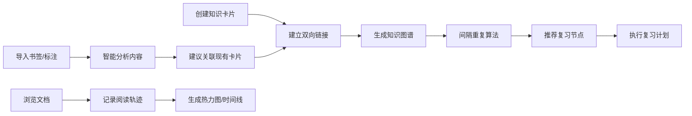

## 1. 产品概述

双链笔记式个人知识库与阅读轨迹可视化平台，帮助用户构建结构化知识网络，追踪阅读路径，实现高效学习与知识管理。通过双向链接、知识图谱、间隔重复等功能，将碎片化信息转化为系统化的个人知识体系。

## 2. 核心功能

### 2.1 用户角色
| 角色 | 注册方式 | 核心权限 |
|------|----------|----------|
| 普通用户 | 本地存储，无需注册 | 创建知识卡片、管理链接、导入数据、查看阅读轨迹、设置复习提醒 |

### 2.2 功能模块
1. **知识卡片管理**：卡片创建、编辑、删除，双向链接建立，标签分类
2. **知识网络图谱**：可视化知识节点与关联，交互式探索，关联密度显示
3. **数据导入模块**：网页书签导入、电子书标注解析、智能关联建议
4. **阅读轨迹模块**：阅读路径记录、跳转热力图、时间线回顾
5. **复习提醒系统**：间隔重复算法、基于关联密度的智能推荐、复习计划管理

### 2.3 页面详情
| 页面名称 | 模块名称 | 功能描述 |
|---------|----------|----------|
| 仪表盘 | 总览模块 | 知识统计卡片、最近复习、快捷操作入口 |
| 知识卡片 | 卡片列表 | 卡片搜索、筛选、标签过滤 |
| 知识卡片 | 卡片编辑器 | Markdown编辑、双向链接插入、标签管理 |
| 知识图谱 | 图谱可视化 | 3D力导向图、节点详情、关联探索 |
| 数据导入 | 导入面板 | 书签文件上传、电子书标注解析、关联建议 |
| 阅读轨迹 | 轨迹可视化 | 阅读热力图、时间线回顾、路径分析 |
| 复习中心 | 复习队列 | 待复习卡片、间隔重复设置、复习历史 |

## 3. 核心流程

用户创建知识卡片，通过双向链接建立关联，系统自动生成知识网络图谱。导入外部资源时，系统智能分析内容并建议与现有卡片建立关联。阅读轨迹模块记录用户浏览路径，生成可视化分析。复习系统基于间隔重复算法和关联密度，智能推荐需要巩固的知识节点。

## 4. 用户界面设计

### 4.1 设计风格
- **主色调**：深空蓝 (#0f172a) 与琥珀金 (#f59e0b)，营造专注而温暖的知识探索氛围
- **辅助色**：翡翠绿 (#10b981) 表示已掌握，玫瑰红 (#f43f5e) 表示需复习
- **按钮风格**：圆角矩形，微玻璃拟态效果，悬停时有柔和的光晕动画
- **字体**：标题使用 Cormorant Garamond 衬线字体，正文使用 JetBrains Mono 等宽字体
- **布局风格**：三栏式布局，左侧导航 + 中间主内容 + 右侧详情面板
- **图标风格**：线性简约图标，配以柔和的发光效果

### 4.2 页面设计概述
| 页面名称 | 模块名称 | UI元素 |
|---------|----------|--------|
| 仪表盘 | 总览模块 | 渐变统计卡片、环形进度图、浮动操作按钮 |
| 知识卡片 | 卡片编辑器 | Markdown工具栏、双向链接自动补全、侧边关联面板 |
| 知识图谱 | 图谱可视化 | 3D力导向节点、拖拽缩放、节点悬浮详情、发光连接线 |
| 阅读轨迹 | 轨迹可视化 | 日历热力图、纵向时间线、路径流动动画 |
| 复习中心 | 复习队列 | 卡片翻转动画、进度条、下一张按钮 |

### 4.3 响应性
- 桌面端：三栏式布局，1280px 以上最优体验
- 平板端：两栏式布局，右侧面板可折叠
- 移动端：单栏流式布局，底部导航栏
- 触控优化：增大点击区域，支持手势滑动切换

### 4.4 视觉特效
- 知识图谱节点悬停时产生脉冲发光效果
- 卡片创建时有从中心向外的渐变出现动画
- 页面切换采用淡入淡出 + 轻微位移的过渡效果
- 背景采用低透明度的网格纹理与渐变叠加
- 滚动时导航栏产生毛玻璃模糊效果
