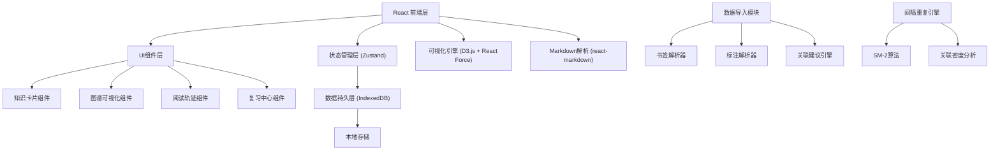
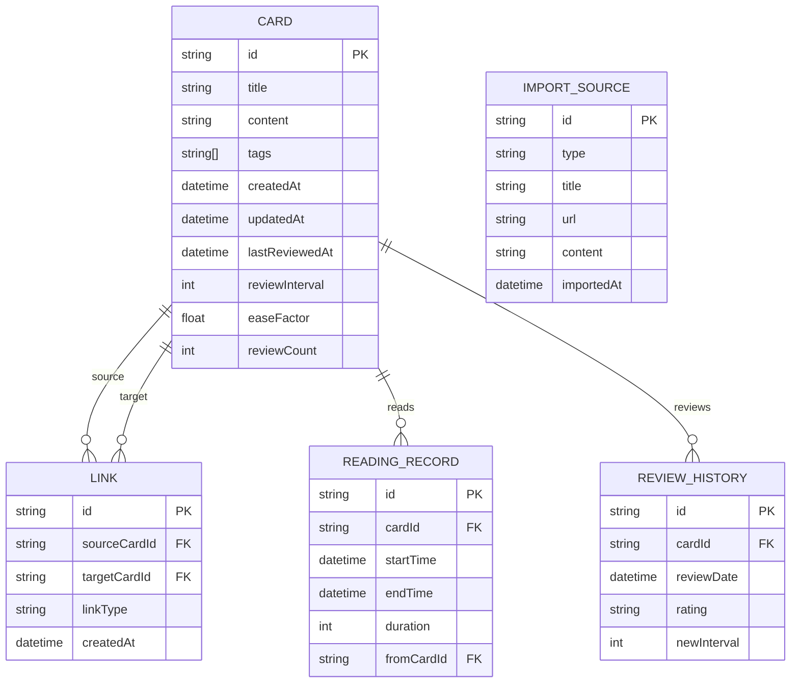

## 1. 架构设计



## 2. 技术描述

- **前端框架**: React@18 + TypeScript + Vite
- **样式方案**: TailwindCSS@3 + CSS Variables
- **状态管理**: Zustand
- **本地数据库**: IndexedDB (Dexie.js)
- **图谱可视化**: d3-force + react-force-graph
- **Markdown解析**: react-markdown + remark-gfm
- **路由管理**: React Router v6
- **图标库**: Lucide React
- **动画库**: Framer Motion
- **日期处理**: date-fns

## 3. 路由定义

| 路由 | 页面 | 组件 |
|------|------|------|
| / | 仪表盘 | DashboardPage |
| /cards | 知识卡片列表 | CardListPage |
| /cards/new | 创建新卡片 | CardEditorPage |
| /cards/:id | 卡片详情/编辑 | CardEditorPage |
| /graph | 知识图谱 | GraphPage |
| /import | 数据导入 | ImportPage |
| /trajectory | 阅读轨迹 | TrajectoryPage |
| /review | 复习中心 | ReviewPage |

## 4. 数据模型

### 4.1 数据模型定义



### 4.2 TypeScript 类型定义

```typescript
interface Card {
  id: string;
  title: string;
  content: string;
  tags: string[];
  createdAt: Date;
  updatedAt: Date;
  lastReviewedAt?: Date;
  reviewInterval: number;
  easeFactor: number;
  reviewCount: number;
}

interface Link {
  id: string;
  sourceCardId: string;
  targetCardId: string;
  linkType: 'forward' | 'backward' | 'bidirectional';
  createdAt: Date;
}

interface ReadingRecord {
  id: string;
  cardId: string;
  startTime: Date;
  endTime: Date;
  duration: number;
  fromCardId?: string;
}

interface GraphNode {
  id: string;
  title: string;
  tagCount: number;
  linkCount: number;
  reviewPriority: number;
  x?: number;
  y?: number;
}

interface GraphLink {
  source: string;
  target: string;
  value: number;
}
```

## 5. 核心算法模块

### 5.1 双向链接解析
- 解析卡片内容中的 `[[卡片标题]]` 语法
- 自动创建反向链接
- 维护链接索引表

### 5.2 关联密度计算
```typescript
function calculateLinkDensity(cardId: string): number {
  const outgoingLinks = getOutgoingLinks(cardId);
  const incomingLinks = getIncomingLinks(cardId);
  const allCards = getAllCards();
  return (outgoingLinks.length + incomingLinks.length) / Math.max(allCards.length, 1);
}
```

### 5.3 间隔重复算法 (SM-2)
```typescript
function calculateNextReview(card: Card, rating: number): Card {
  let { easeFactor, reviewInterval, reviewCount } = card;
  
  if (rating < 3) {
    reviewCount = 0;
    reviewInterval = 1;
  } else {
    if (reviewCount === 0) reviewInterval = 1;
    else if (reviewCount === 1) reviewInterval = 6;
    else reviewInterval = Math.round(reviewInterval * easeFactor);
    reviewCount++;
  }
  
  easeFactor = Math.max(1.3, easeFactor + (0.1 - (5 - rating) * (0.08 + (5 - rating) * 0.02)));
  
  return {
    ...card,
    easeFactor,
    reviewInterval,
    reviewCount,
    lastReviewedAt: new Date()
  };
}
```

### 5.4 智能关联建议
- 基于TF-IDF计算内容相似度
- 基于标签重叠度计算关联概率
- 综合评分排序推荐关联卡片
